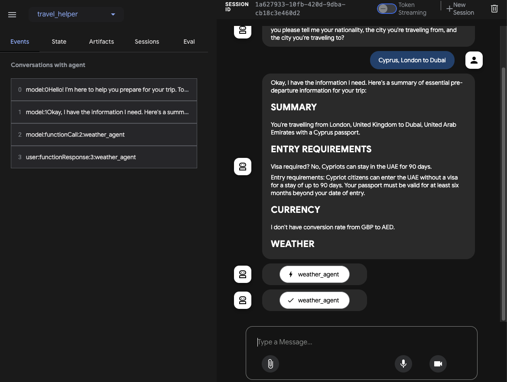

# Travel Helper Agent

## Introduction

Before you travel, you need to know some essential pre-departure information such as the entry rules for the country 
you're travelling to, the weather in the destination, the currency of the destination, top tourist spots and so on. 
Of course, you can search this information for every trip but that takes time and it's so old school! 

Instead, let's build a travel helper agent! This agent gathers the necessary information about the upcoming trip 
and provides essential pre-departure information you need for your trip.

Travel Helper Agent will rely on other agents to help. Follow these steps to build the sub-agents, combine them into 
a root agent, run and deploy the agent.

## Build sub-agents

### Greeter Agent

First, we need to greet the traveler and gather the necessary information about the upcoming trip such as the nationality
of the traveler, departure and arrival cities. 

That's what this agent is for!

Go through [greeter](./sub_agents/greeter) to build the agent. 

### Google Search Agent

Next, we want to provide some useful information to the travel such as the entry rules to destination country, how to
get from the airport to the city center, and top tourist attractions in the destination city. 

Google Search is great for this kind of information and it's available as a tool to ADK.

Go through [google_search](./sub_agents/google_search) to build an agent using Google Search.

### Weather Agent

It's good to know how the weather is in the destination city before you get there. You can ask this to Google Search
but it's also possible to ask Weather APIs for more precise weather information. 

You can have functions calling any API as tools in ADK.

Go through [weather](./sub_agents/weather) to build an agent using Weather APIs.

### Currency Agent

Another useful information to know is the currency of the destination country and the currency rate between the home
country and the destination country. That's what the currency agent is for!

Go through [currency](./sub_agents/currency) to build an agent using a currency API to convert between currencies.

## Build root agent 

### Travel Helper Agent

Finally, it's time to put it all together. The travel agent helper is the root agent that will combine all 
the sub-agents.

Take a look at the [agent.py](agent.py) for details. 

## Run root agent

There are multiple ways to test and run the root agent.

### Run agent - CLI

You can use `adk run` to interact with the agent from a provided CLI interface: 

```shell
adk run ./travel_helper
```

You should start getting some pre-departure travel information:

```shell
user: Hi
[travel_helper_agent]: Hi there! I'm here to provide you with essential pre-departure information for your trip. To get started, could you please tell me your nationality, the city you're travelling from, and the city you're travelling to?

user: I'm from Cyprus and I'm traveling from London to Dubai
[travel_helper_agent]: Okay, I've got your information. I will now gather the essential pre-departure details for your trip from London to Dubai. Here's the information you requested:

SUMMARY
-------
You're travelling from London, UK to Dubai, UAE with a Cypriot passport.

ENTRY REQUIREMENTS
------------------
Visa required? No, Cypriots can stay in the UAE for 90 days without a visa.
...
```

### Run agent - web

You can use `adk web` to interact with the agent from a provided Web UI

Outside the folder of the agent use `adk web`:

```shell
adk web
```

Go to `http://0.0.0.0:8080`, choose your agent from the drop-down, and start chatting with your agent:



### Run agent - programmatically

`adk run` and `adk web` are great for development and testing, but at some point, you need to interact with the agent
programmatically. This typically involves creating a runner with a session and the agent.

Take a look at the [agent_runner](../agent_runner) for details on how you can set this up. 

## Deploy root agent

ADK has a few [deployment options](https://google.github.io/adk-docs/deploy/): Vertex AI Agent Engine, Cloud Run, or 
self-managed.  

### Deploy to Cloud Run

Let's deploy the agent to Cloud Run with the dev UI enabled. 

First make sure the necessary APIs are enabled:

```shell
gcloud services enable artifactregistry.googleapis.com \
  cloudbuild.googleapis.com \
  run.googleapis.com
```

Then, deploy using the `adk` tool:

```shell
adk deploy cloud_run \
  --project="your-project-id" \
  --region="us-central1" \
  --service_name="travel-helper-service" \
  --with_ui \
  ./travel_helper
```

This builds a container for the agent and deploys to Cloud Run. You can visit the default URL of the Cloud Run service
to interact with the agent.

### Deploy to Vertex AI Agent Engine

Let's deploy the agent to Vertex AI Agent.

First, make sure the agent engine libraries are installed:

```shell
pip install 'google-cloud-aiplatform[agent_engines]'
```

Create a staging bucket for the agent engine:

```shell
PROJECT_ID=your-project-id
STAGING_BUCKET=gs://$PROJECT_ID-agent-engine-staging
gsutil mb $STAGING_BUCKET
```

Deploy using the `adk` tool:

```shell
adk deploy agent_engine \
  --project $PROJECT_ID \
  --region us-central1 \
  --display_name travel-helper-agent \
  --staging_bucket $STAGING_BUCKET \
  --trace_to_cloud \
  ./travel_helper
```

## Evaluate Agents

Let's now see how to evaluate agents and make sure they behave as you expect in [evaluate_agents](./docs/evaluate_agents.md).

## Filesystem Assistant Agent with Model Context Protocol

If you're running the agent locally, you might want to save the travel information in a text file. 

Go through [filesystem_assistant](./sub_agents/filesystem_assistant) to build an agent to have access to the file system
using a reference MCP server and ADK's MCPToolset.

